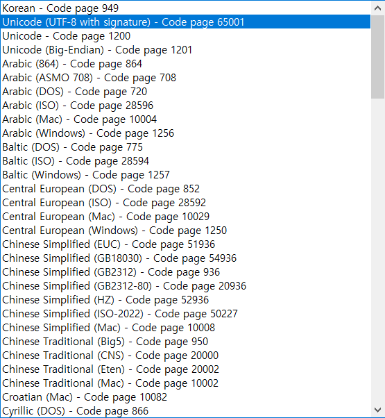

# C#

**C#** 은 Microsoft에서 개발한 객체 지향 프로그래밍 언어

## C#의 주요 특징

- **객체 지향 프로그래밍**: 클래스, 객체, 상속, 캡슐화 등 객체 지향 프로그래밍(OOP) 개념을 지원합니다.
- **강력한 형식 시스템**: 코드 안정성을 높여주고 오류를 최소화할 수 있도록 엄격한 형식 검사를 지원합니다.
- **다양한 플랫폼 지원**: .NET Framework, .NET Core, Xamarin, Unity 등을 통해 Windows뿐만 아니라 Linux, macOS, Android, iOS 등 다양한 플랫폼에서 실행됩니다.
- **풍부한 라이브러리 지원**: .NET 생태계를 통해 웹 개발, 데이터베이스 접근, 파일 처리 등 수많은 작업을 손쉽게 구현할 수 있도록 풍부한 라이브러리를 제공합니다.

## 트러블 슈팅

Visual Studio에서 `README.md` 파일을 생성할 때, 일부 환경에서는 기본 인코딩이 ANSI로 설정됨.  
이 경우 한글이 GitHub나 다른 플랫폼에서 깨져 보일 수 있으므로, 파일을 **Unicode (UTF-8 with signature) - Code page 65001** 인코딩으로 저장해야 합니다.

## 문서 목록

- [XML 문서 주석 정리](./xml-doc-comments.md)
- [Singleton Pattern 정리](./singleton-pattern.md)
- [WinForms 학습 자료](./winforms/README.md)
- [WPF 학습 자료](./wpf/README.md)
- [SQL-Server](./sql-server/README.md)
- [파일 복사 설정 (CopyToOutputDirectory)](csproj/copy-to-output.md)

## 참고자료

- [Microsoft 공식 C# 문서](https://learn.microsoft.com/ko-kr/dotnet/csharp/)  
  C# 언어 개요, 문법, 기능별 예제 및 최신 업데이트 반영

- [Microsoft Learn - C# 경로](https://learn.microsoft.com/ko-kr/training/paths/csharp-first-steps/)  
  입문자를 위한 단계별 온라인 강의. 실습형 튜토리얼 포함

- [.NET API 브라우저](https://learn.microsoft.com/ko-kr/dotnet/api/)  
  .NET 모든 클래스와 메서드를 검색하고 설명 확인 가능

- [.NET Blog (영문)](https://devblogs.microsoft.com/dotnet/)  
  C# 및 .NET의 새로운 기능, 릴리즈, 내부 기술 이야기 등 최신 동향 제공

- [C# Programming Guide (영문)](https://learn.microsoft.com/en-us/dotnet/csharp/programming-guide/)  
  C# 전체 기능에 대한 체계적인 공식 가이드 (문법, LINQ, async 등)

- [Awesome .NET (GitHub)](https://github.com/quozd/awesome-dotnet)  
  커뮤니티가 정리한 .NET 관련 유용한 라이브러리, 도구, 학습 자료 모음

- [Roslyn GitHub (C# 컴파일러)](https://github.com/dotnet/roslyn)  
  C# 컴파일러 및 코드 분석기의 공식 저장소. 고급자에게 유용

- [DevExpress 공식 예제 모음](https://github.com/DevExpress-Examples)  
  다양한 DevExpress 컨트롤 예제를 WinForms, WPF, ASP.NET 등 기술별로 제공
